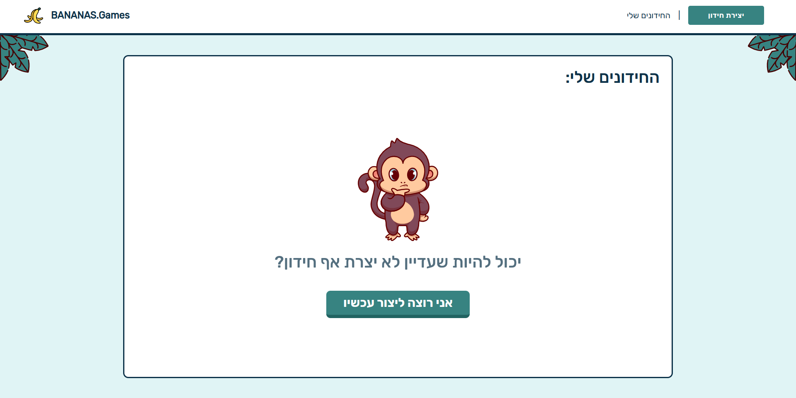

## Screenshots




# Quiz Game

This project was made as a practice project. It allows the user to create quizes. Play other user's quizes and have lots of fun together.


## Installation

  To get started with the Quiz Game, follow these steps:

Clone the repository: 

```bash
git clone https://github.com/ZivFisher/TriviaGame.git
```

Navigate to the project directory: 

```bash
cd TriviaGame
```

Install dependencies: 

```bash
npm install
```

Create a database named: 

```bash
"quiz_game".
```

Run the dump file: 

```bash
"/dumps/add_roles" 
```

Start the server in development enviroment: 

```bash
npm run start:dev
```

Start the client:

```bash
npm run start
```


## Tech Stack

**Client:** React, SCSS, Mui, Axios, react-beautiful-dnd

**Server:** NodeJS, NestJS


## Authors

- [@ZivFisher](https://github.com/ZivFisher)
- [@yotam-hanoch](https://github.com/yotam-hanoch)
- [@YehonatanCohenTavor](https://github.com/YehonatanCohenTavor)
- [@ElyasafTsarum](https://github.com/RonRicher)
- [@reshitAriel](https://github.com/reshitAriel)

